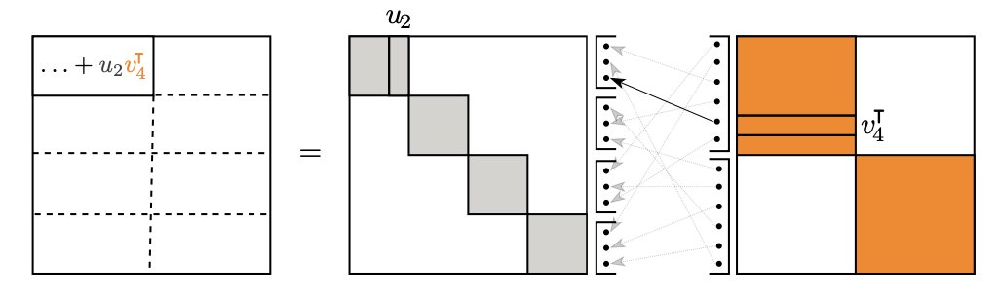

# Group and Shuffle: Efficient Structured Orthogonal Parametrization

This repo contains code for the NeurIPS 2024 conference paper ["Group and Shuffle: Structured Orthogonal Parametrezation"](https://arxiv.org/abs/2406.10019). 

## Abstract

The increasing size of neural networks has led to a growing demand for methods of efficient fine-tuning. Recently, an orthogonal fine-tuning paradigm was introduced that uses orthogonal matrices for adapting the weights of a pretrained model. In this paper, we introduce a new class of structured matrices, which unifies and generalizes structured classes from previous works. We examine properties of this class and build a structured orthogonal parametrization upon it. We then use this parametrization to modify the orthogonal fine-tuning framework, improving parameter and computational efficiency. We empirically validate our method on different domains, including adapting of text-to-image diffusion models and downstream task fine-tuning in language modeling. Additionally, we adapt our construction for orthogonal convolutions and conduct experiments with 1-Lipschitz neural networks.

## Navigation

We conduct experiments in 3 different domanins: NLP, Diffusion Models and Convolutional Architectures. 

Directory `glue` contains code and instructions for fine-tuning $\text{RoBERTa}_{\text{base}}$ model with `GSOFT` method.

Directory `gsoft_diffusion` is devoted to subject-driven generation experiments with StableDiffusion model.

Finally, directory `gs_conv` contains code for experiments with orthogonal convolutions. 

## Citation 
TBA